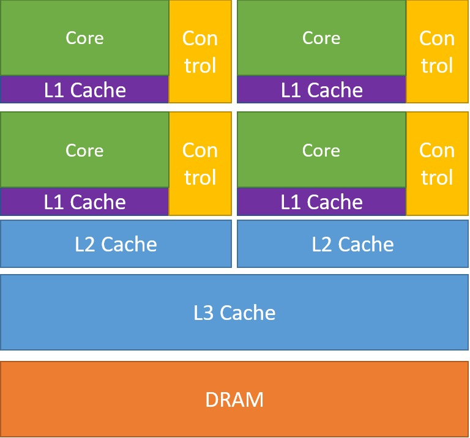
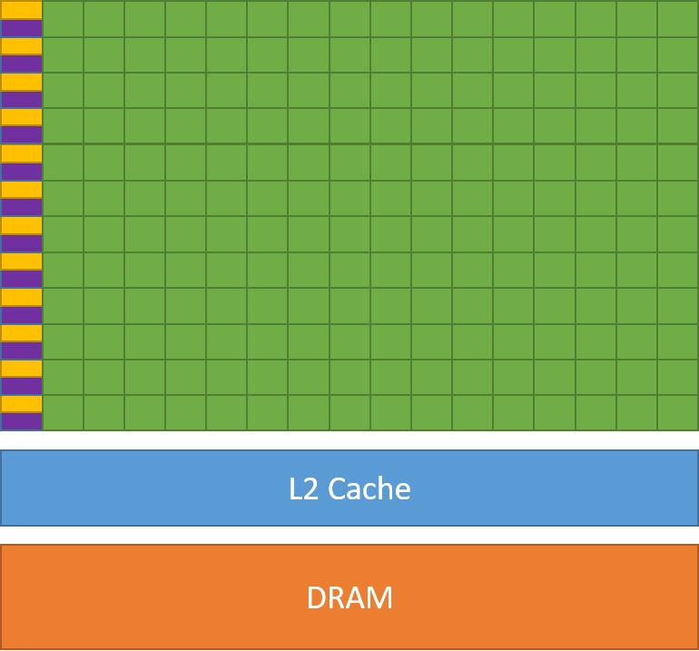

<!--
SPDX-FileCopyrightText: 2024 CSC - IT Center for Science Ltd. <www.csc.fi>

SPDX-License-Identifier: CC-BY-4.0
-->

# Understanding GPU Architecture for High-Performance Computing

Modern supercomputers increasingly rely on GPUs to deliver their peak performance. Yet writing efficient GPU code requires understanding not just the programming APIs, but the underlying hardware — how threads are organized, how memory is structured, and why these details matter for performance. This post walks through the key concepts of GPU architecture and execution models that every HPC programmer should know.

---

## Why GPUs?

The growth of GPU-accelerated computing is not accidental. GPUs offer two major practical advantages over CPUs: very high peak floating-point performance per node, and significantly better FLOPS per watt. For workloads with high arithmetic intensity and abundant parallelism — such as dense linear algebra, stencil operations, or machine learning — GPUs can deliver speedups of one to two orders of magnitude over CPU-only implementations.

The trade-off is that GPUs are *specialized* hardware. They excel at parallel, regular workloads but are poorly suited to serial, branch-heavy code. Porting an application to a GPU often requires a significant rewrite, and the programmer must reason explicitly about parallelism, memory placement, and data movement in ways that CPU programming usually does not demand.


<div class="column">

{.center width=65%}
</div>

<div class="column"> 
{.center width=100%}
</div>


### CPU vs. GPU: A Design Philosophy Contrast

The architectural differences between CPUs and GPUs reflect fundamentally different design goals:

A **CPU** is optimized to minimize *latency* for individual tasks. It has a small number of powerful, general-purpose cores (typically 16–128), large caches, and complex control logic for out-of-order execution and branch prediction. It is designed to run any sequential task as fast as possible.

A **GPU** is optimized to maximize *throughput* across many simultaneous tasks. It achieves this by packing thousands of simpler cores onto a single chip, trading per-core complexity for raw parallelism. Rather than minimizing latency, a GPU *hides* latency by rapidly switching between thousands of active threads while others wait for memory.

This distinction — latency-optimized vs. throughput-optimized — is the single most important concept for understanding when and how to use a GPU effectively.


<div class="column" style="width:49%;">
  <strong>CPU</strong>

  { width=45%} 
  <div style="font-size:0.4em;">
    <em>Image credits: CUDA Programming Guide</em>
  </div>
</div>

<div class="column" style="width:49%;">
  <strong>GPU</strong>
    
  {width=45%}
  <div style="font-size:0.4em;">
    <em>Image credits: CUDA Programming Guide</em>
  </div>
</div>


---

## The GPU Programming Model

GPUs operate as *co-processors* to the CPU. The CPU (called the **host**) runs the main program and remains in control of the overall workflow. The GPU (the **device**) is used to accelerate specific, compute-intensive sections of the program. The host is responsible for:

- Launching computational work on the GPU by submitting **kernels**
- Allocating and deallocating GPU memory
- Managing data transfers between host and device memory

Kernel launches are typically **asynchronous** — the host submits work and continues executing without waiting for the GPU to finish. This allows the CPU and GPU to work concurrently, which is important for overlapping data transfers with computation.

### What Is a Kernel?

A kernel is a function that runs on the GPU. Unlike a normal CPU function that executes once, a kernel is executed simultaneously by many GPU threads — each processing a different element of the data. This is the SIMT model: **Single Instruction, Multiple Threads**.

Consider the AXPY operation (`y = y + a*x`). On a CPU, this is a loop:

```cpp
void axpy(int n, double a, double* x, double* y) {
    for (int i = 0; i < n; i++) {
        y[i] += a * x[i];
    }
}
```

On a GPU, the loop is replaced by a grid of threads. Each thread handles one index, and the kernel is written from the perspective of a single thread:

```cpp
// GPU kernel — runs once per thread, each with a different value of id
void axpy_kernel(int n, double a, double* x, double* y, int id) {
    y[id] += a * x[id]; // id < n
}
```

The GPU runtime launches enough threads to cover the entire array, and schedules them all to run in parallel on the available hardware.

---

## GPU Thread Hierarchy

GPU threads are not a flat collection — they are organized in a strict three-level hierarchy that maps directly to the physical hardware.

### Threads and Warps / Wavefronts


<div class="column">


{.center width=5%}

<div align="center"><small>A thread is running on execution unit</small></div>

</div>

<div class="column">

{.center width=31%} 

<div align="center"><small>The smallest execution unit in a GPU.</small></div>
</div>


Individual GPU threads are very lightweight execution contexts. Each thread runs the same kernel but operates on different data. Threads are grouped together at the hardware level into units called **warps** (NVIDIA, 32 threads) or **wavefronts** (AMD, 64 threads).


<div class="column">


{.center width=20%}

<div align="center"><small>Execution is done per warp / wavefront</small></div>

</div>

<div class="column">

{.center width=68%} 

<div align="center"><small>Scheme of a SIMD unit in an AMD GPU</small></div>
</div>

All threads within a warp/wavefront execute the same instruction at the same time — this is the hardware-level realization of SIMT. If threads in the same warp/wavefront take different branches (e.g., due to an `if` statement), both branches are executed sequentially and threads not following the active branch are masked out. This is called **branch divergence** and should be avoided wherever possible, as it reduces effective parallelism.

Memory accesses are also performed at the warp/wavefront level, which has important implications for performance (discussed below).

### Thread Blocks / Work-Groups


<div class="column">

{.center width=14%}

<div align="center"><small>Thread blocks</small></div>

</div>

<div class="column">
{.center width=15%}

<div align="center"><small>Compute Unit in an AMD GPU</small></div>
</div>

Threads are organized into **thread blocks** (NVIDIA/AMD terminology) or **work-groups** (SYCL/Intel terminology). Each block executes on a specific hardware unit:

- A **Streaming Multiprocessor (SM)** on NVIDIA hardware
- A **Compute Unit (CU)** on AMD hardware

The maximum number of threads per block is limited by hardware. Importantly, threads within the same block can:

- **Synchronize** with each other via barriers
- **Communicate** through fast on-chip local shared memory

Threads in different blocks cannot directly synchronize or share memory.

### The Grid

<div class="column">

{.center width=41%}

<div align="center"><small>A grid of thread blocks executing the same **kernel**</small></div>

</div>

<div class="column">
{.center width=60%}

<div align="center"><small>AMD Instinct MI100 architecture (source: AMD)</small></div>
</div>

Thread blocks are organized into a **grid** (called an **NDRange** in SYCL). The total number of threads launched equals the number of blocks multiplied by the threads per block. To keep the GPU fully occupied and hide memory latency, there should generally be more blocks than there are compute units on the device.

There is **no synchronization** between different blocks during kernel execution.

### Terminology Across Vendors

The same concepts appear under different names depending on the platform:

| Concept | NVIDIA | AMD | SYCL / Intel |
|---|---|---|---|
| Grid of all threads | grid | grid | NDRange |
| Group of threads on one CU/SM | block | block | work-group |
| Hardware-level thread group | warp | wavefront | sub-group |
| Individual thread | thread | thread | work-item |

---

## Memory Hierarchy

Understanding the GPU memory hierarchy is essential for writing high-performance code. Memory accesses are almost always the bottleneck in GPU applications, and choosing the right memory type for each use case can make a large difference in performance.

### Host and Device Memory

In most GPU systems, the GPU has its own dedicated **device memory** that is physically separate from the CPU's main memory. Data used by GPU kernels must be explicitly transferred from host to device before a kernel runs, and results must be transferred back afterward.

These transfers happen over a bus (typically PCIe) that has significantly lower bandwidth than either the CPU memory bus or the GPU memory bus. Frequent or large transfers can become a serious performance bottleneck and should be minimized.
{.center width=65%}

**Unified/managed memory** is an alternative that provides a single address space accessible by both CPU and GPU. The runtime automatically migrates memory pages to whichever processor needs them. This simplifies programming but can introduce implicit transfers at unpredictable times — so memory access patterns should be profiled carefully when using this model.

### Global Memory

Global memory is the main GPU memory pool, accessible by all threads in all blocks. It is large (tens of gigabytes on modern hardware) and has very high bandwidth — for example, a single Graphics Compute Die (GCD) of the AMD MI250X delivers around 1,600 GB/s. However, individual access latency is high (600–700 cycles), which is why the GPU's threading model is designed to hide latency by keeping thousands of threads in flight simultaneously.

### Coalesced Memory Access

Because memory accesses are performed at the warp/wavefront level, the access pattern of all threads in a warp matters enormously. When threads access **adjacent memory locations** (i.e., thread `id` accesses element `id`), the hardware can **coalesce** those accesses into a small number of wide memory transactions, maximizing effective bandwidth.
{.center width=65%}
When accesses are **strided** or **non-aligned**, the hardware cannot coalesce them, and each thread's access may require a separate transaction — multiplying the memory traffic and degrading bandwidth utilization dramatically.


```cpp
GPU_K void axpy_(int n, double a, double *x, double *y, int id)
{
        y[id] += a * x[id]; // Coalesced 
        y[id] += a * x[id*stride]; // Strided Non-Coalesced 
        y[id] += a * x[id+shift]; // Shifted (non-aligned) Non-Coalesced 
}

```

### Local Shared Memory

Local shared memory is a fast, on-chip memory region shared by all threads within a block/work-group. Its latency is roughly 100× lower than global memory (around 6 cycles vs. 600–700 cycles). It can be thought of as a **user-programmable cache** — unlike CPU caches, it is explicitly managed by the programmer.
{.center width=25%}
Common uses of local shared memory include:

- **Tiling**: loading a tile of data from global memory into shared memory once, then reusing it many times within the block
- **Reductions**: accumulating partial results within a block before writing to global memory
- **Improving access patterns**: loading non-coalesced global data into shared memory, then accessing it in a coalesced pattern

Local shared memory has the lifetime of the thread block — it is allocated when the block starts and released when it finishes.

### Registers

Registers are the fastest memory available on the GPU — private to each thread and used for local variables and intermediate results. Reading from a register has effectively zero latency; however, read-after-write latency (~24 cycles) is non-negligible.

Registers are not directly controllable by the programmer. If a kernel uses more registers than the hardware provides per thread, the overflow spills into global memory — a condition called **register spilling** that can significantly hurt performance.

### Summary of the Memory Hierarchy

| Memory type | Scope | Latency | Bandwidth | Lifetime |
|---|---|---|---|---|
| Registers | Per thread | ~0 cycles | Highest | Kernel |
| Local shared memory | Per block | ~6 cycles | Very high | Thread block |
| Global memory | All threads | ~600–700 cycles | High (but limited) | Program |
| Host memory | CPU only | Very high (+ PCIe) | Low | Program |

---

## How to Use GPUs

There is a spectrum of approaches for GPU programming, ranging from high-level and portable to low-level and hardware-specific:

1. **Use existing GPU applications** — no programming required if a suitable application exists.
2. **Use GPU-accelerated libraries** — cuBLAS, rocBLAS, oneMKL, and similar libraries expose highly optimized routines.
3. **Language standard features** — C++ `std::par` and Fortran `DO CONCURRENT` can target GPUs with compatible compilers.
4. **Directive-based methods** — OpenMP and OpenACC add GPU offloading annotations to existing code with relatively low effort.
5. **High-level GPU frameworks** — Kokkos, SYCL, Alpaka, and RAJA provide portable abstractions over different hardware backends.
6. **Direct GPU programming** — CUDA (NVIDIA) and HIP (AMD) give the most control over hardware but are vendor-specific.

The choice between these approaches involves a trade-off between portability, programmability, and the ability to squeeze out maximum performance on a given piece of hardware.

---

## GPU Resources at CSC

CSC operates several GPU-equipped systems available to Finnish researchers:

- **Puhti-AI**: 80 nodes, each with four NVIDIA V100 GPUs and two 20-core Intel Xeon processors. Total peak performance: 2.7 Petaflops.
- **Mahti-AI**: 24 nodes, each with four NVIDIA A100 GPUs and two 64-core AMD EPYC processors. Total peak performance: 2.0 Petaflops.
- **Roihu-AI**: 423 nodes, each with four NVIDIA GH200 GPUs and AMD  processors. Total peak performance: x Petaflops.
- **LUMI-G**: 2,978 nodes, each with four AMD MI250X GPUs and one 64-core AMD EPYC processor. Total peak performance: 500 Petaflops.

---

## Key Takeaways

GPU programming is rewarding but demands a solid mental model of the hardware. The key points to keep in mind:

- GPUs are co-processors: the CPU controls the workflow and offloads work to the GPU.
- Parallelism is organized in a three-level hierarchy: threads → blocks → grid. Synchronization and shared memory are only possible *within* a block.
- All threads in a warp/wavefront execute the same instruction. Branch divergence and non-coalesced memory access are the two most common sources of GPU performance loss.
- Memory placement matters enormously. Use registers and local shared memory where possible, minimize global memory accesses, and avoid unnecessary host–device transfers.
- High-level frameworks like SYCL and Kokkos abstract over these hardware details while preserving portability — but understanding the underlying model is still essential for writing efficient code.

---

*For a practical introduction to programming GPUs using SYCL, see our [Part I](../sycl/ppp_with_sycl.part_I.md) and [Part II](../sycl/ppp_with_sycl.part_II.md) blog posts.*