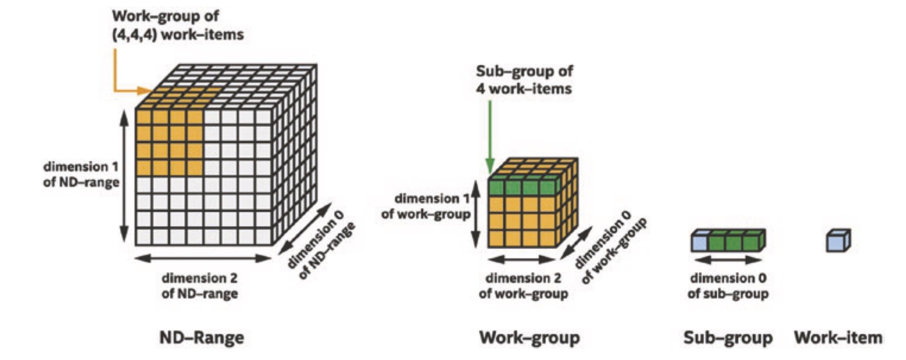

<!--
SPDX-FileCopyrightText: 2025 CSC - IT Center for Science Ltd. <www.csc.fi>

SPDX-License-Identifier: CC-BY-4.0
-->

# Performance Portable C++ Programming with SYCL — Part I

One of the central challenges in high-performance computing today is balancing hardware diversity with code maintainability. Modern systems span CPUs, GPUs, and specialized accelerators, each with its own memory hierarchy, threading model, and instruction set. A program targeting CPUs, NVIDIA GPUs, AMD GPUs, and Intel GPUs may require four separate implementations — for example, plain C++, CUDA, HIP, and Intel DPC++ respectively. Several frameworks aim to address this fragmentation, including Kokkos, OpenMP, Alpaka, and SYCL. This post introduces SYCL through a practical example.

Like [Alpaka](https://alpaka.readthedocs.io/) and [Kokkos](https://kokkos.org/), [SYCL](https://www.khronos.org/sycl/) is a C++ framework that provides abstractions enabling a single codebase to run in parallel across different hardware backends. SYCL is developed by the [Khronos Group](https://www.khronos.org/) and was first introduced in 2014 as the provisional version 1.2. It has since gone through several major revisions. The current version, **SYCL 2020 (Revision 11)**, is compatible with the C++17 and C++20 standards and supports the latest OpenCL.

SYCL is built around the **3P principle**: *Productivity*, *Portability*, and *Performance*. Beyond simply running the same code on different hardware, it aims to use device resources efficiently. Equally important is productivity — making it easier to develop, maintain, and evolve code over time.

---

## SYCL Implementations

To develop SYCL code, you need a SYCL *implementation* — a set of components that includes:

- A **template library** exposing SYCL functionality.
- A **compiler** that translates SYCL code into machine code for various hardware targets.
- A **runtime library** that manages execution, memory, task scheduling, and synchronization.
- **Backend support** for devices via OpenCL, CUDA, HIP, Level Zero, OpenMP, and others.

Debugging and performance analysis tools may be included, but the best results are typically achieved with native vendor tools.

The SYCL ecosystem is broad, with implementations from multiple vendors covering diverse hardware — including FPGAs and ASICs:

- **Intel oneAPI** — Full support for the SYCL 2020 specification via the DPC++/C++ Compiler.
- **AdaptiveCpp** — An independent, community-driven platform for C++-based heterogeneous programming.
- **triSYCL** — A research project for experimenting with the SYCL specification.
- **neoSYCL** — A SYCL implementation targeting the SX-Aurora TSUBASA vector processor.
- **SimSYCL** — A single-threaded, library-only SYCL 2020 implementation for testing against simulated hardware.

In HPC contexts, **Intel oneAPI** and **AdaptiveCpp** are the most relevant. Intel oneAPI is developed by Intel and primarily targets CPUs and Intel GPUs, with optional support for NVIDIA and AMD GPUs. AdaptiveCpp (formerly hipSYCL/OpenCpp), started by researchers at Heidelberg University, supports CPUs via OpenMP, NVIDIA GPUs via CUDA, and AMD GPUs via ROCm, with limited Intel GPU support through the Level Zero backend.

Both Intel oneAPI and AdaptiveCpp can be installed on CSC machines (Roihu and LUMI), though this requires some effort.

---

## SYCL Programming Model

The SYCL programming model closely mirrors the GPU programming model used in CUDA and HIP. A *host* (the CPU) runs the main program, while computationally intensive work is offloaded to a *device*.

The host is responsible for:
- Initializing offloading devices.
- Managing memory allocations and deallocations.
- Staging memory transfers between host and device memory.

Work is offloaded by launching many instances of a device function called a **kernel**, which runs in parallel across many device threads. Each thread executes the kernel from the perspective of a single thread.

> **Note:** In HPC contexts, the "device" can be a multi-core CPU or a NVIDIA, AMD, or Intel GPU.

---

## SYCL Queues

The **queue** is the most fundamental concept in SYCL. Queues act as bridges between the host and an assigned device — all computation and memory operations are submitted through them.

Queue operations are **asynchronous** when supported by the hardware: after a submission is dispatched to the runtime for scheduling, the host continues executing. By default, queues are **out-of-order**, meaning submitted operations may start in any order unless a dependency is explicitly specified. **In-order queues** are also available and guarantee sequential execution of submissions.

### Choosing a Device

The simplest way to create a queue is:

```cpp
queue q;
```

This selects the best available device according to the implementation's rules. For example, in a system with one CPU and one GPU, the GPU is typically selected; in a system without a discrete GPU, the CPU becomes the offloading device.

When multiple GPUs are present and the default selection is not appropriate, a **custom device selector** can be used:

```cpp
using namespace sycl;

class custom_selector : public device_selector {
public:
  int operator()(const device& dev) const override {
    int score = -1;
    if (dev.is_gpu()) {
      auto vendor = dev.get_info<info::device::vendor>();
      if (vendor.find("NVIDIA") != std::string::npos) score += 75;
      if (vendor.find("Intel")  != std::string::npos) score += 50;
      if (vendor.find("AMD")    != std::string::npos) score += 100;
    }
    if (dev.is_host()) score += 25; // Fallback if no GPU is available
    return score;
  }
};
```

```cpp
auto q = queue{ custom_selector{} };

std::cout << "Running on: "
          << q.get_device().get_info<info::device::vendor>() << " "
          << q.get_device().get_info<info::device::name>()   << std::endl;
```

In multi-node HPC jobs with multiple GPUs per node (e.g., Mahti or LUMI), all MPI processes on a node see all available GPUs. Correct device assignment then depends on the MPI rank. SYCL provides `get_devices()` to enumerate available GPUs and assign them uniquely:

```cpp
auto gpu_devices = sycl::device::get_devices(sycl::info::device_type::gpu);
auto n_gpus = gpu_devices.size();

std::cout << "Found " << n_gpus << " GPU(s)" << std::endl;

if (n_gpus > 0) {
  queue q{ gpu_devices[my_rank] }; // Assign one GPU per MPI rank
} else {
  std::cerr << "No GPUs found. Exiting." << std::endl;
  exit(1);
}
```

### Queue Member Functions

The queue class provides member functions for all interaction with the device:

| Category | Functions |
|---|---|
| Work submission | `submit()`, `parallel_for()`, `single_task()` |
| Memory operations | `memcpy()`, `fill()`, `copy()`, `memset()` |
| Queue inspection | `is_empty()`, `get_device()`, `get_context()` |
| Synchronization | `wait()`, `wait_and_throw()` |

### Command Groups

**Command groups** are the mechanism by which SYCL bundles related operations — kernel launches and memory transfers — into a single submission. They provide a self-contained description of the work and its data dependencies, enabling the runtime to schedule everything efficiently.

```cpp
q.submit([&](handler& cgh) {
  /* Command group body: define accessors, then launch kernel */
});
```

---

## Memory Management

SYCL provides two complementary memory models: the **Buffer–Accessor model**, which automates data movement based on declared dependencies, and **Unified Shared Memory (USM)**, which gives you explicit, pointer-based control similar to CUDA or standard C++.

### Buffer–Accessor Model

The Buffer–Accessor model is the original memory model in SYCL and follows the C++ RAII philosophy. Rather than moving data explicitly, you associate a **buffer** with your data and describe access patterns through **accessors** inside kernels. The runtime then automatically schedules transfers and enforces ordering between kernels.

```cpp
std::vector<int> hy(N, 1);
{
  // Wrap host data in a buffer — no transfer happens yet
  buffer<int> y_buf(hy.data(), range<1>(N));

  q.submit([&](handler& cgh) {
    // Declare how this kernel will access the data
    accessor y{ y_buf, cgh, read_write };

    cgh.parallel_for(range<1>(N), [=](id<1> i) {
      y[i] += 1; // Increment each element
    });
  });

  // Access results on the host without destroying the buffer
  host_accessor y_acc(y_buf, read_only);
  for (int i = 0; i < N; i++) {
    assert(y_acc[i] == 2);
  }
  // Destroy host_accessor before submitting further GPU work
}
// Buffer goes out of scope here — results are written back to hy
```

A `host_accessor` lets the host read buffer data without destroying the buffer. It acts like any other accessor: no subsequent kernel using the same buffer will start until the `host_accessor` is destroyed. This is a convenient way to express dependencies, but care must be taken to avoid deadlocks by ensuring accessors are released when no longer needed.

**Important caveats:**
- Directly accessing the underlying host variable (`hy`) while a buffer is live is not reflected in device memory and leads to undefined behavior.
- Buffers are views of data, not tied to any specific queue. A transfer is triggered when an accessor is created inside a command group, which can sometimes cause unintended transfers and performance loss.

These limitations motivated the introduction of Unified Shared Memory.

### Unified Shared Memory (USM)

In the USM model, memory management is explicit and pointer-based — similar to CUDA. You control exactly where data lives, when it is transferred, and when it is freed. There are no automatic transfers or implicit dependencies.

```cpp
std::vector<int> h_y(N, 2), h_x(N, 1);
int a = 4;

// Allocate memory on the device
int* d_x = malloc_device<int>(N, q);
int* d_y = malloc_device<int>(N, q);

// Copy data from host to device
q.memcpy(d_x, h_x.data(), N * sizeof(int)); q.wait();
q.memcpy(d_y, h_y.data(), N * sizeof(int)); q.wait();

// ... kernel work here ...

// Free device memory when no longer needed
sycl::free(d_x, q);
sycl::free(d_y, q);
```

> **Warning:** Unlike C++ smart pointers or SYCL buffers, USM device pointers are **not freed automatically** when they go out of scope. Forgetting to call `sycl::free()` will cause a device memory leak.

USM supports three allocation types:

| Function | Memory Location | Accessible by Device? |
|---|---|---|
| `malloc_device` | Device | Yes |
| `malloc_shared` | Migrates dynamically | Yes |
| `malloc_host`   | Host | Device can read/write |

---

## Launching Kernels

Computations are offloaded by launching many device threads in parallel, each executing a kernel that processes a different portion of the data. In SYCL, kernels are expressed as **lambda functions**.

SYCL offers two kernel launch methods: the **range** method (simpler, runtime-controlled) and the **nd-range** method (explicit, programmer-controlled).

### The `range` Method

This is the simpler, higher-level approach. You specify the problem size and dimensionality; the runtime decides how to map work to hardware.

```cpp
// Using id<1> — provides thread index only
cgh.parallel_for(range<1>(N), [=](id<1> idx) {
  // Use idx to identify this thread's work item
});

// Using item<1> — additionally provides the total range size
cgh.parallel_for(range<1>(N), [=](item<1> item) {
  auto idx = item.get_id();
  auto R   = item.get_range();
  // Use idx and R
});
```

This approach is quick to write and sufficient for many kernels. However, it offers no control over **work-group size**, no access to **local (shared) memory**, no ability to **synchronize threads within a work-group**, and no support for **subgroup/warp/wavefront-level operations**.

### The `nd_range` Method

For finer-grained control, use `nd_range`. This allows you to specify work-group (block) size and, where the hardware supports it, subgroup size. This is necessary for memory optimization techniques and intra-group synchronization.

```cpp
size_t local_size  = 256;
// Global size must be a multiple of local_size
size_t global_size = ((N + local_size - 1) / local_size) * local_size;

q.parallel_for(
  nd_range<1>(range<1>(global_size), range<1>(local_size)),
  [=](nd_item<1> item) {
    size_t global_idx = item.get_global_id(0);
    size_t local_idx  = item.get_local_id(0);
    size_t group_idx  = item.get_group(0);

    if (global_idx < N) { // Guard against out-of-bounds access
      // Work using global_idx, local_idx, or group_idx
    }
  });
q.wait();
```



The `nd_item` object exposes the thread's index within its work-group (`local_idx`), the work-group's index in the grid (`group_idx`), and the global thread index (`global_idx`) — giving full control over how the launch maps to GPU hardware.

> **Note:** Both memory models (Buffer–Accessor and USM) can be used with either kernel launch method.

---

## Example: `Y = Y + a*X` (AXPY)

With the above concepts in hand, we can write a complete SYCL program. The **AXPY** operation (`Y = a*X + Y`) is a classic HPC benchmark and a good illustration of the key concepts.

The data is initialized on the host, the computation is offloaded to a device, results are copied back, and a correctness check is performed. We show two versions:

- **High-level:** Uses the Buffer–Accessor model with the `range` kernel launch — most control delegated to the runtime.
- **Explicit:** Uses USM with the `nd_range` kernel launch — the programmer manages everything.

### High-Level Version (Buffer–Accessor + `range`)

```cpp
// SPDX-FileCopyrightText: 2021 CSC - IT Center for Science Ltd. <www.csc.fi>
// SPDX-License-Identifier: MIT

#include <iostream>
#include <sycl/sycl.hpp>
using namespace sycl;

int main() {
  queue q; // Select best available device

  constexpr size_t N = 25600;
  std::vector<int> x(N, 1), y(N, 2);
  int a = 4;

  {
    // Wrap host arrays in buffers
    buffer<int> x_buf(x.data(), range<1>(N));
    buffer<int> y_buf(y.data(), range<1>(N));

    q.submit([&](handler& h) {
      // Declare access modes — read_only avoids an unnecessary transfer of x back to host
      accessor x_acc(x_buf, h, read_only);
      accessor y_acc(y_buf, h, read_write);

      h.parallel_for(range<1>(N), [=](id<1> i) {
        y_acc[i] = a * x_acc[i] + y_acc[i];
      });
    });

    // host_accessor blocks until kernel finishes — no explicit wait() needed
    host_accessor y_acc(y_buf, read_only);
    bool passed = std::all_of(y_acc.begin(), y_acc.end(),
                              [a](int val) { return val == a * 1 + 2; });
    std::cout << (passed ? "SUCCESS" : "FAILURE") << " (inside buffer scope)" << std::endl;
  }
  // Buffers go out of scope here — y is updated on the host automatically

  bool passed = std::all_of(y.begin(), y.end(),
                            [a](int val) { return val == a * 1 + 2; });
  std::cout << (passed ? "SUCCESS" : "FAILURE") << " (after buffer scope)" << std::endl;
  return passed ? 0 : 1;
}
```

**What happens at runtime (when profiled on a NVIDIA or AMD GPU):**
1. GPU memory allocations
2. CPU → GPU data transfers
3. Kernel execution
4. GPU → CPU data transfer
5. GPU memory deallocations

All of this is managed automatically by the runtime. The explicit version requires the programmer to handle each step manually.

### Explicit Version (USM + `nd_range`)

```cpp
// SPDX-FileCopyrightText: 2021 CSC - IT Center for Science Ltd. <www.csc.fi>
// SPDX-License-Identifier: MIT

#include <iostream>
#include <sycl/sycl.hpp>
#include <vector>
#include <algorithm>
using namespace sycl;

int main() {
  queue q;

  constexpr size_t N = 25600;
  std::vector<int> x(N, 1), y(N, 2);
  int a = 4;

  // Allocate device memory
  int* d_x = malloc_device<int>(N, q);
  int* d_y = malloc_device<int>(N, q);

  // Copy host data to device — wait() ensures transfers complete before the kernel starts
  q.memcpy(d_x, x.data(), N * sizeof(int)); q.wait();
  q.memcpy(d_y, y.data(), N * sizeof(int)); q.wait();

  // Launch kernel with explicit work-group sizing
  size_t local_size  = 256;
  size_t global_size = ((N + local_size - 1) / local_size) * local_size;

  q.submit([&](handler& h) {
    h.parallel_for(
      nd_range<1>(range<1>(global_size), range<1>(local_size)),
      [=](nd_item<1> item) {
        size_t i = item.get_global_id(0);
        if (i < N) {
          d_y[i] = a * d_x[i] + d_y[i];
        }
      });
  });
  q.wait(); // Wait for kernel to finish before copying results back

  // Copy results to host
  q.memcpy(y.data(), d_y, N * sizeof(int)); q.wait();

  // Free device memory explicitly — no automatic cleanup!
  sycl::free(d_x, q);
  sycl::free(d_y, q);

  bool passed = std::all_of(y.begin(), y.end(),
                            [a](int val) { return val == a * 1 + 2; });
  std::cout << (passed ? "SUCCESS" : "FAILURE") << std::endl;
  return passed ? 0 : 1;
}
```

Note that `q.wait()` is used repeatedly to enforce ordering between asynchronous operations. While straightforward, this approach is coarse-grained — it pauses the host until *all* queued operations finish. Part II will introduce finer-grained dependency management using events.

---

## Installing on CSC Machines

Relevant repositories and installation guides:

- [https://github.com/csc-training/portable-gpu-programming/tree/main](https://github.com/csc-training/portable-gpu-programming/tree/main)
- [https://github.com/csc-training/high-level-gpu-programming](https://github.com/csc-training/high-level-gpu-programming)

---

## Pros & Cons

**Advantages:**
- SYCL code is clean and structured. Its general layout maps closely to CUDA/HIP, and with in-order queues, a CUDA C program can often be ported to SYCL almost one-to-one.
- A single codebase targets CPUs, NVIDIA, AMD, and Intel GPUs.

**Limitations:**
- There is a steep learning curve before using GPUs efficiently.
- Some hardware-specific features are not portable: memory pools, CUDA Graphs, cooperative kernel launches, and dynamic parallelism have no direct SYCL equivalents.

---

## Resources and Further Reading

- [https://github.com/csc-training/portable-gpu-programming/tree/main](https://github.com/csc-training/portable-gpu-programming/tree/main)
- [https://github.com/csc-training/high-level-gpu-programming](https://github.com/csc-training/high-level-gpu-programming)
- [Data Parallel C++, second edition](https://link.springer.com/book/10.1007/978-1-4842-9691-2)
    - [book examples](https://github.com/Apress/data-parallel-CPP.git)

---

*Coming up in Part II: fine-grained dependency management with events, local memory, and subgroup operations.*
